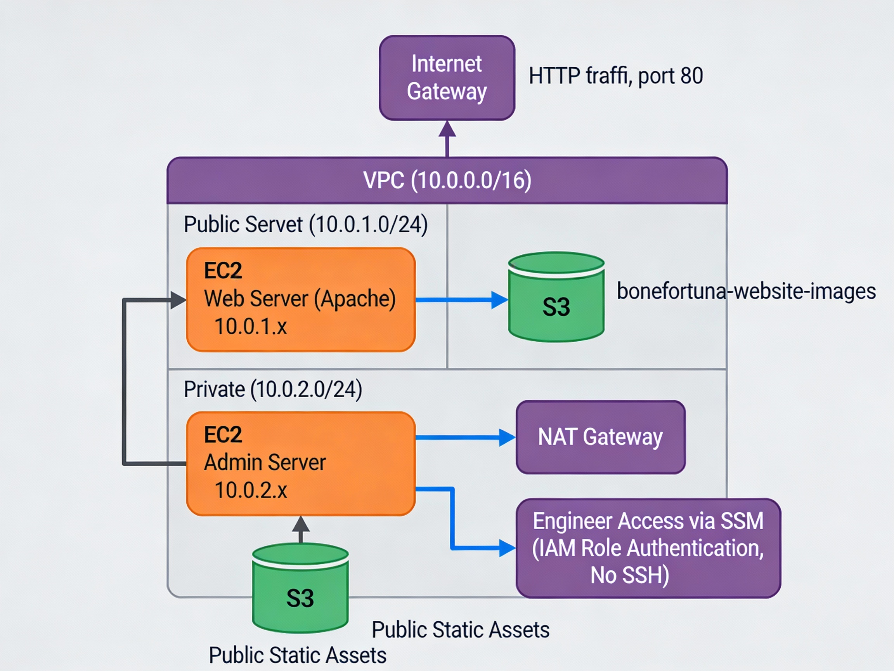

# week4-secure-web-architecture
Multi-tier AWS infrastructure with Terraform - Public web server, private admin server, S3 static assets, and SSM-based access control
# Secure Public Website with Private Infrastructure

> Multi-tier AWS architecture demonstrating production-grade security, network segmentation, and Infrastructure-as-Code best practices.

**Live Demo:** http://18.208.206.23  
**Project Date:** January 31, 2026  
**Bootcamp:** Cloud Engineering - Week 4 Final Project

---

## 🏗️ Architecture Overview



### Key Features
- ✅ Public web server (Apache on EC2) with internet access
- ✅ Private admin server with zero internet exposure
- ✅ S3 static assets (decoupled storage)
- ✅ SSM-based access (no SSH keys required)
- ✅ Infrastructure as Code (Terraform)
- ✅ Production security posture (IAM roles, security groups, network segmentation)
- ✅ Cost-optimized (< $60/month)

---

## 📋 Project Scenario

**Client:** European logistics company migrating to AWS  
**Requirement:** Public-facing website with secure backend infrastructure  
**Constraints:** No direct SSH access, IAM-based authentication, cost under $100/month

---

## 🔧 Tech Stack

- **IaC:** Terraform 1.x
- **Cloud Provider:** AWS (us-east-1)
- **Compute:** EC2 (t2.micro)
- **Web Server:** Apache HTTP Server
- **Storage:** S3 Standard
- **Networking:** VPC, NAT Gateway, Internet Gateway
- **Access Control:** AWS Systems Manager (SSM), IAM Roles
- **OS:** Amazon Linux 2

---

## 🚀 Quick Start

```bash
git clone https://github.com/cjames-boop/week4-secure-web-architecture.git
cd week4-secure-web-architecture
terraform init
terraform plan
terraform apply
